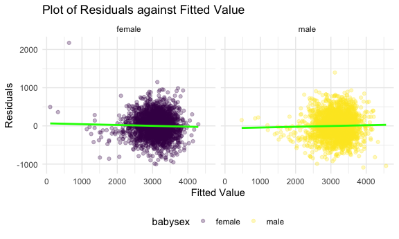
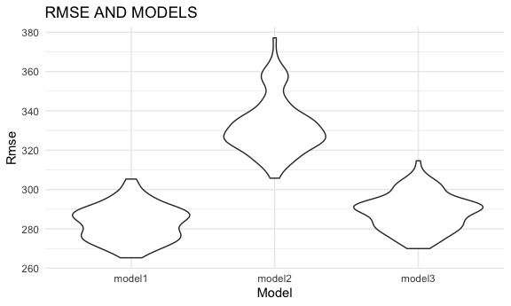
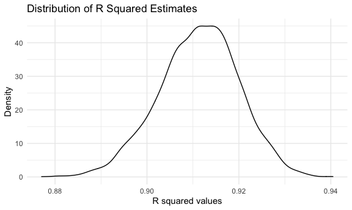
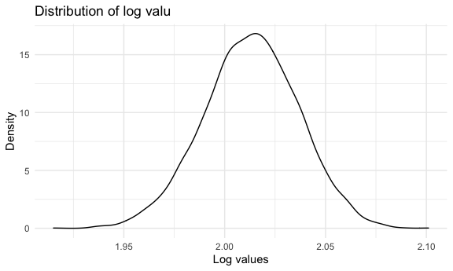

p8105\_hw6\_fs2757
================
FEI SUN
2021/12/2

# Problem 1

``` r
birthweight_raw = 
  read_csv("data/birthweight.csv") %>% 
  janitor::clean_names()%>% 
  mutate(
    babysex = case_when(babysex == "1" ~ "male",
                        babysex == "2" ~ "female"),
    frace = case_when(frace == "1" ~ "White",
                      frace == "2" ~ "Black",
                      frace == "3" ~ "Asian",
                      frace == "4" ~ "Puerto Rican", 
                      frace == "8" ~ "Other",
                      frace == "9" ~ "Unknown"),
    malform = case_when(malform == "0" ~ "absent",
                        malform == "1" ~ "present"),
    mrace = case_when(mrace == "1" ~ "White",
                      mrace == "2" ~ "Black",
                      mrace == "3" ~ "Asian",
                      mrace == "4" ~ "Puerto Rican",
                      mrace == "8" ~ "Other"),
    babysex = as.factor(babysex),
    frace = as.factor(frace),
    malform = as.factor(malform),
    mrace = as.factor(mrace))
```

    ## Rows: 4342 Columns: 20

    ## ── Column specification ────────────────────────────────────────────────────────
    ## Delimiter: ","
    ## dbl (20): babysex, bhead, blength, bwt, delwt, fincome, frace, gaweeks, malf...

    ## 
    ## ℹ Use `spec()` to retrieve the full column specification for this data.
    ## ℹ Specify the column types or set `show_col_types = FALSE` to quiet this message.

``` r
skimr::skim(birthweight_raw)
```

|                                                  |                  |
|:-------------------------------------------------|:-----------------|
| Name                                             | birthweight\_raw |
| Number of rows                                   | 4342             |
| Number of columns                                | 20               |
| \_\_\_\_\_\_\_\_\_\_\_\_\_\_\_\_\_\_\_\_\_\_\_   |                  |
| Column type frequency:                           |                  |
| factor                                           | 4                |
| numeric                                          | 16               |
| \_\_\_\_\_\_\_\_\_\_\_\_\_\_\_\_\_\_\_\_\_\_\_\_ |                  |
| Group variables                                  | None             |

Data summary

**Variable type: factor**

| skim\_variable | n\_missing | complete\_rate | ordered | n\_unique | top\_counts                             |
|:---------------|-----------:|---------------:|:--------|----------:|:----------------------------------------|
| babysex        |          0 |              1 | FALSE   |         2 | mal: 2230, fem: 2112                    |
| frace          |          0 |              1 | FALSE   |         5 | Whi: 2123, Bla: 1911, Pue: 248, Asi: 46 |
| malform        |          0 |              1 | FALSE   |         2 | abs: 4327, pre: 15                      |
| mrace          |          0 |              1 | FALSE   |         4 | Whi: 2147, Bla: 1909, Pue: 243, Asi: 43 |

**Variable type: numeric**

| skim\_variable | n\_missing | complete\_rate |    mean |     sd |     p0 |     p25 |     p50 |     p75 |   p100 | hist  |
|:---------------|-----------:|---------------:|--------:|-------:|-------:|--------:|--------:|--------:|-------:|:------|
| bhead          |          0 |              1 |   33.65 |   1.62 |  21.00 |   33.00 |   34.00 |   35.00 |   41.0 | ▁▁▆▇▁ |
| blength        |          0 |              1 |   49.75 |   2.72 |  20.00 |   48.00 |   50.00 |   51.00 |   63.0 | ▁▁▁▇▁ |
| bwt            |          0 |              1 | 3114.40 | 512.15 | 595.00 | 2807.00 | 3132.50 | 3459.00 | 4791.0 | ▁▁▇▇▁ |
| delwt          |          0 |              1 |  145.57 |  22.21 |  86.00 |  131.00 |  143.00 |  157.00 |  334.0 | ▅▇▁▁▁ |
| fincome        |          0 |              1 |   44.11 |  25.98 |   0.00 |   25.00 |   35.00 |   65.00 |   96.0 | ▃▇▅▂▃ |
| gaweeks        |          0 |              1 |   39.43 |   3.15 |  17.70 |   38.30 |   39.90 |   41.10 |   51.3 | ▁▁▂▇▁ |
| menarche       |          0 |              1 |   12.51 |   1.48 |   0.00 |   12.00 |   12.00 |   13.00 |   19.0 | ▁▁▂▇▁ |
| mheight        |          0 |              1 |   63.49 |   2.66 |  48.00 |   62.00 |   63.00 |   65.00 |   77.0 | ▁▁▇▂▁ |
| momage         |          0 |              1 |   20.30 |   3.88 |  12.00 |   18.00 |   20.00 |   22.00 |   44.0 | ▅▇▂▁▁ |
| parity         |          0 |              1 |    0.00 |   0.10 |   0.00 |    0.00 |    0.00 |    0.00 |    6.0 | ▇▁▁▁▁ |
| pnumlbw        |          0 |              1 |    0.00 |   0.00 |   0.00 |    0.00 |    0.00 |    0.00 |    0.0 | ▁▁▇▁▁ |
| pnumsga        |          0 |              1 |    0.00 |   0.00 |   0.00 |    0.00 |    0.00 |    0.00 |    0.0 | ▁▁▇▁▁ |
| ppbmi          |          0 |              1 |   21.57 |   3.18 |  13.07 |   19.53 |   21.03 |   22.91 |   46.1 | ▃▇▁▁▁ |
| ppwt           |          0 |              1 |  123.49 |  20.16 |  70.00 |  110.00 |  120.00 |  134.00 |  287.0 | ▅▇▁▁▁ |
| smoken         |          0 |              1 |    4.15 |   7.41 |   0.00 |    0.00 |    0.00 |    5.00 |   60.0 | ▇▁▁▁▁ |
| wtgain         |          0 |              1 |   22.08 |  10.94 | -46.00 |   15.00 |   22.00 |   28.00 |   89.0 | ▁▁▇▁▁ |

There are no missing value in the dataset. Also I convert the numeric
variable to the factor.

``` r
model1 = lm(bwt ~gaweeks + babysex + mheight + ppwt + wtgain + parity + smoken + bhead + mrace + frace + malform, data = birthweight_raw)
summary(model1)
```

    ## 
    ## Call:
    ## lm(formula = bwt ~ gaweeks + babysex + mheight + ppwt + wtgain + 
    ##     parity + smoken + bhead + mrace + frace + malform, data = birthweight_raw)
    ## 
    ## Residuals:
    ##      Min       1Q   Median       3Q      Max 
    ## -1088.43  -211.58    -1.68   204.37  2173.25 
    ## 
    ## Coefficients:
    ##                     Estimate Std. Error t value Pr(>|t|)    
    ## (Intercept)       -5381.3983   161.8347 -33.252  < 2e-16 ***
    ## gaweeks              19.9606     1.6587  12.034  < 2e-16 ***
    ## babysexmale         -22.0134     9.7093  -2.267   0.0234 *  
    ## mheight              11.4697     2.0394   5.624 1.98e-08 ***
    ## ppwt                  1.9527     0.2663   7.332 2.68e-13 ***
    ## wtgain                5.4998     0.4484  12.266  < 2e-16 ***
    ## parity               74.2742    46.3118   1.604   0.1088    
    ## smoken               -6.7193     0.6710 -10.013  < 2e-16 ***
    ## bhead               198.0515     3.3685  58.795  < 2e-16 ***
    ## mraceBlack          -56.0018    92.6802  -0.604   0.5457    
    ## mracePuerto Rican     9.2377    92.6871   0.100   0.9206    
    ## mraceWhite          103.8208    82.3966   1.260   0.2077    
    ## fraceBlack          -41.2463    90.4087  -0.456   0.6483    
    ## fraceOther          -57.0841   111.9218  -0.510   0.6101    
    ## fracePuerto Rican   -62.2455    90.0432  -0.691   0.4894    
    ## fraceWhite          -26.2586    79.4810  -0.330   0.7411    
    ## malformpresent      -31.3401    81.0268  -0.387   0.6989    
    ## ---
    ## Signif. codes:  0 '***' 0.001 '**' 0.01 '*' 0.05 '.' 0.1 ' ' 1
    ## 
    ## Residual standard error: 312.8 on 4325 degrees of freedom
    ## Multiple R-squared:  0.6284, Adjusted R-squared:  0.6271 
    ## F-statistic: 457.2 on 16 and 4325 DF,  p-value: < 2.2e-16

``` r
broom::tidy(model1)
```

    ## # A tibble: 17 × 5
    ##    term              estimate std.error statistic   p.value
    ##    <chr>                <dbl>     <dbl>     <dbl>     <dbl>
    ##  1 (Intercept)       -5381.     162.     -33.3    4.16e-216
    ##  2 gaweeks              20.0      1.66    12.0    7.84e- 33
    ##  3 babysexmale         -22.0      9.71    -2.27   2.34e-  2
    ##  4 mheight              11.5      2.04     5.62   1.98e-  8
    ##  5 ppwt                  1.95     0.266    7.33   2.68e- 13
    ##  6 wtgain                5.50     0.448   12.3    5.02e- 34
    ##  7 parity               74.3     46.3      1.60   1.09e-  1
    ##  8 smoken               -6.72     0.671  -10.0    2.39e- 23
    ##  9 bhead               198.       3.37    58.8    0        
    ## 10 mraceBlack          -56.0     92.7     -0.604  5.46e-  1
    ## 11 mracePuerto Rican     9.24    92.7      0.0997 9.21e-  1
    ## 12 mraceWhite          104.      82.4      1.26   2.08e-  1
    ## 13 fraceBlack          -41.2     90.4     -0.456  6.48e-  1
    ## 14 fraceOther          -57.1    112.      -0.510  6.10e-  1
    ## 15 fracePuerto Rican   -62.2     90.0     -0.691  4.89e-  1
    ## 16 fraceWhite          -26.3     79.5     -0.330  7.41e-  1
    ## 17 malformpresent      -31.3     81.0     -0.387  6.99e-  1

``` r
birthweight_raw %>% 
  modelr::add_residuals(model1) %>% 
  modelr::add_predictions(model1) %>% 
  ggplot(aes(x = pred, y = resid,color=babysex))+
  geom_point(alpha = 0.3)+
  geom_smooth(color = "green",method = "lm", se = F)+
  facet_grid(. ~ babysex)+
  labs(
    x = "Fitted Value",
    y = "Residuals",
    title = "Plot of Residuals against Fitted Value"
  )
```

    ## `geom_smooth()` using formula 'y ~ x'



About model 1, I will using almost all clinically relevant variables as
predictors(X) based on current literature and removed all
non-significant predictors. From the plot, it shows that the residuals
are relatively evenly distributed around y = 0 and it satisfies the
linearity assumption.

``` r
model2 = lm(bwt ~blength + gaweeks, data = birthweight_raw)
summary(model2)
```

    ## 
    ## Call:
    ## lm(formula = bwt ~ blength + gaweeks, data = birthweight_raw)
    ## 
    ## Residuals:
    ##     Min      1Q  Median      3Q     Max 
    ## -1709.6  -215.4   -11.4   208.2  4188.8 
    ## 
    ## Coefficients:
    ##              Estimate Std. Error t value Pr(>|t|)    
    ## (Intercept) -4347.667     97.958  -44.38   <2e-16 ***
    ## blength       128.556      1.990   64.60   <2e-16 ***
    ## gaweeks        27.047      1.718   15.74   <2e-16 ***
    ## ---
    ## Signif. codes:  0 '***' 0.001 '**' 0.01 '*' 0.05 '.' 0.1 ' ' 1
    ## 
    ## Residual standard error: 333.2 on 4339 degrees of freedom
    ## Multiple R-squared:  0.5769, Adjusted R-squared:  0.5767 
    ## F-statistic:  2958 on 2 and 4339 DF,  p-value: < 2.2e-16

``` r
broom::tidy(model2)
```

    ## # A tibble: 3 × 5
    ##   term        estimate std.error statistic  p.value
    ##   <chr>          <dbl>     <dbl>     <dbl>    <dbl>
    ## 1 (Intercept)  -4348.      98.0      -44.4 0       
    ## 2 blength        129.       1.99      64.6 0       
    ## 3 gaweeks         27.0      1.72      15.7 2.36e-54

``` r
model3 = lm(bwt ~bhead + blength + babysex + 
              bhead * blength + bhead * babysex + blength * babysex + bhead * blength * babysex, data = birthweight_raw)
summary(model3)
```

    ## 
    ## Call:
    ## lm(formula = bwt ~ bhead + blength + babysex + bhead * blength + 
    ##     bhead * babysex + blength * babysex + bhead * blength * babysex, 
    ##     data = birthweight_raw)
    ## 
    ## Residuals:
    ##      Min       1Q   Median       3Q      Max 
    ## -1132.99  -190.42   -10.33   178.63  2617.96 
    ## 
    ## Coefficients:
    ##                             Estimate Std. Error t value Pr(>|t|)    
    ## (Intercept)                -801.9487  1102.3077  -0.728 0.466948    
    ## bhead                       -16.5975    34.0916  -0.487 0.626388    
    ## blength                     -21.6460    23.3720  -0.926 0.354421    
    ## babysexmale               -6374.8684  1677.7669  -3.800 0.000147 ***
    ## bhead:blength                 3.3244     0.7126   4.666 3.17e-06 ***
    ## bhead:babysexmale           198.3932    51.0917   3.883 0.000105 ***
    ## blength:babysexmale         123.7729    35.1185   3.524 0.000429 ***
    ## bhead:blength:babysexmale    -3.8781     1.0566  -3.670 0.000245 ***
    ## ---
    ## Signif. codes:  0 '***' 0.001 '**' 0.01 '*' 0.05 '.' 0.1 ' ' 1
    ## 
    ## Residual standard error: 287.7 on 4334 degrees of freedom
    ## Multiple R-squared:  0.6849, Adjusted R-squared:  0.6844 
    ## F-statistic:  1346 on 7 and 4334 DF,  p-value: < 2.2e-16

``` r
broom::tidy(model3)
```

    ## # A tibble: 8 × 5
    ##   term                      estimate std.error statistic    p.value
    ##   <chr>                        <dbl>     <dbl>     <dbl>      <dbl>
    ## 1 (Intercept)                -802.    1102.       -0.728 0.467     
    ## 2 bhead                       -16.6     34.1      -0.487 0.626     
    ## 3 blength                     -21.6     23.4      -0.926 0.354     
    ## 4 babysexmale               -6375.    1678.       -3.80  0.000147  
    ## 5 bhead:blength                 3.32     0.713     4.67  0.00000317
    ## 6 bhead:babysexmale           198.      51.1       3.88  0.000105  
    ## 7 blength:babysexmale         124.      35.1       3.52  0.000429  
    ## 8 bhead:blength:babysexmale    -3.88     1.06     -3.67  0.000245

``` r
cv_df =
  crossv_mc(birthweight_raw, 100) %>%
  mutate(
    train = map(train, as_tibble),
    test = map(test, as_tibble))%>%
  mutate(
    model_1  = map(train, ~lm(bwt ~babysex + bhead + blength + delwt + fincome, data = .x)),
    model_2  = map(train, ~lm(bwt ~blength + gaweeks, data = .x)),
    model_3  = map(train, ~lm(bwt ~bhead + blength + babysex + 
              bhead * blength + bhead * babysex + blength * babysex + bhead * blength * babysex,
              data = .x))) %>% 
  mutate(rmse_model1 = 
        map2_dbl(model_1, test, ~rmse(model = .x, data = .y)),
        rmse_model2 = 
        map2_dbl(model_2, test, ~rmse(model = .x, data = .y)),
        rmse_model3 =
        map2_dbl(model_3, test, ~rmse(model = .x, data = .y)))
cv_df
```

    ## # A tibble: 100 × 9
    ##    train test  .id   model_1 model_2 model_3 rmse_model1 rmse_model2 rmse_model3
    ##    <lis> <lis> <chr> <list>  <list>  <list>        <dbl>       <dbl>       <dbl>
    ##  1 <tib… <tib… 001   <lm>    <lm>    <lm>           293.        360.        302.
    ##  2 <tib… <tib… 002   <lm>    <lm>    <lm>           278.        322.        280.
    ##  3 <tib… <tib… 003   <lm>    <lm>    <lm>           272.        307.        279.
    ##  4 <tib… <tib… 004   <lm>    <lm>    <lm>           296.        337.        298.
    ##  5 <tib… <tib… 005   <lm>    <lm>    <lm>           296.        367.        303.
    ##  6 <tib… <tib… 006   <lm>    <lm>    <lm>           278.        314.        282.
    ##  7 <tib… <tib… 007   <lm>    <lm>    <lm>           287.        357.        290.
    ##  8 <tib… <tib… 008   <lm>    <lm>    <lm>           297.        346.        301.
    ##  9 <tib… <tib… 009   <lm>    <lm>    <lm>           280.        327.        287.
    ## 10 <tib… <tib… 010   <lm>    <lm>    <lm>           284.        338.        292.
    ## # … with 90 more rows

``` r
cv_df %>% 
  select(starts_with("rmse")) %>% 
  pivot_longer(
    everything(),
    names_to = "model", 
    values_to = "rmse",
    names_prefix = "rmse_") %>% 
  mutate(model = fct_inorder(model)) %>% 
  ggplot(aes(x = model, y = rmse)) + 
  geom_violin() +
   labs(
        title = "RMSE AND MODELS",
        x = "Model",
        y = "Rmse"
      )
```



From the plot, the model 2 has the highest prediction error distribution
and the model 1 has the lowest prediction error distribution

# Problem 2

``` r
weather_df = 
  rnoaa::meteo_pull_monitors(
    c("USW00094728"),
    var = c("PRCP", "TMIN", "TMAX"), 
    date_min = "2017-01-01",
    date_max = "2017-12-31") %>%
  mutate(
    name = recode(id, USW00094728 = "CentralPark_NY"),
    tmin = tmin / 10,
    tmax = tmax / 10) %>%
  select(name, id, everything())
```

    ## Registered S3 method overwritten by 'hoardr':
    ##   method           from
    ##   print.cache_info httr

    ## using cached file: ~/Library/Caches/R/noaa_ghcnd/USW00094728.dly

    ## date created (size, mb): 2021-10-12 10:11:19 (7.604)

    ## file min/max dates: 1869-01-01 / 2021-10-31

``` r
weather_df 
```

    ## # A tibble: 365 × 6
    ##    name           id          date        prcp  tmax  tmin
    ##    <chr>          <chr>       <date>     <dbl> <dbl> <dbl>
    ##  1 CentralPark_NY USW00094728 2017-01-01     0   8.9   4.4
    ##  2 CentralPark_NY USW00094728 2017-01-02    53   5     2.8
    ##  3 CentralPark_NY USW00094728 2017-01-03   147   6.1   3.9
    ##  4 CentralPark_NY USW00094728 2017-01-04     0  11.1   1.1
    ##  5 CentralPark_NY USW00094728 2017-01-05     0   1.1  -2.7
    ##  6 CentralPark_NY USW00094728 2017-01-06    13   0.6  -3.8
    ##  7 CentralPark_NY USW00094728 2017-01-07    81  -3.2  -6.6
    ##  8 CentralPark_NY USW00094728 2017-01-08     0  -3.8  -8.8
    ##  9 CentralPark_NY USW00094728 2017-01-09     0  -4.9  -9.9
    ## 10 CentralPark_NY USW00094728 2017-01-10     0   7.8  -6  
    ## # … with 355 more rows

``` r
bootstrap_r =
  weather_df %>% 
  modelr::bootstrap(n = 5000) %>% 
  mutate(
    models = map(strap, ~lm( tmax ~ tmin , data = .x) ),
    results = map(models, broom::glance)) %>% 
  select(.id, results) %>% 
  unnest(results)

bootstrap_r
```

    ## # A tibble: 5,000 × 13
    ##    .id   r.squared adj.r.squared sigma statistic   p.value    df logLik   AIC
    ##    <chr>     <dbl>         <dbl> <dbl>     <dbl>     <dbl> <dbl>  <dbl> <dbl>
    ##  1 0001      0.898         0.897  3.08     3185. 8.83e-182     1  -928. 1861.
    ##  2 0002      0.913         0.913  2.93     3833. 5.33e-195     1  -910. 1825.
    ##  3 0003      0.902         0.901  2.99     3332. 5.64e-185     1  -917. 1840.
    ##  4 0004      0.904         0.904  3.08     3410. 1.23e-186     1  -928. 1862.
    ##  5 0005      0.920         0.920  2.82     4188. 2.07e-201     1  -896. 1798.
    ##  6 0006      0.904         0.903  3.03     3403. 1.79e-186     1  -921. 1849.
    ##  7 0007      0.917         0.917  2.89     4023. 1.68e-198     1  -905. 1816.
    ##  8 0008      0.919         0.919  2.84     4125. 2.65e-200     1  -899. 1803.
    ##  9 0009      0.915         0.915  2.90     3928. 8.83e-197     1  -905. 1816.
    ## 10 0010      0.906         0.906  2.96     3508. 1.20e-188     1  -913. 1832.
    ## # … with 4,990 more rows, and 4 more variables: BIC <dbl>, deviance <dbl>,
    ## #   df.residual <int>, nobs <int>

``` r
bootstrap_r %>% 
ggplot(aes(x = r.squared)) + 
  geom_density() +
   labs(
      x = "R squared values",
      y = "Density",
      title = "Distribution of R Squared Estimates")
```



``` r
bootstrap_r%>% 
  summarize(
    CI_lower = quantile(r.squared, 0.025),
    CI_upper = quantile(r.squared, 0.975)
  ) %>% 
  knitr::kable()
```

| CI\_lower | CI\_upper |
|----------:|----------:|
| 0.8936977 | 0.9274807 |

The plot shows that the R squared estimates appear to be normally
distributed with a mean with 0.911. The 95% confidence interval for r
squared is (0.8932225, 0.9271586).

``` r
bootstrap_log =
  weather_df %>% 
  modelr::bootstrap(n = 5000)%>% 
  mutate(
    models = map(strap, ~lm( tmax ~ tmin , data = .x) ),
    results = map(models, broom::tidy)) %>% 
  select(.id, results) %>% 
  unnest(results)%>% 
  select(.id, term, estimate) %>% 
  pivot_wider(
    names_from = "term",
    values_from = "estimate"
  ) %>% 
  mutate(
    log = log(`(Intercept)` * tmin)
  ) 
bootstrap_log
```

    ## # A tibble: 5,000 × 4
    ##    .id   `(Intercept)`  tmin   log
    ##    <chr>         <dbl> <dbl> <dbl>
    ##  1 0001           7.22  1.04  2.01
    ##  2 0002           7.17  1.04  2.01
    ##  3 0003           7.23  1.04  2.02
    ##  4 0004           7.16  1.03  2.00
    ##  5 0005           7.39  1.02  2.02
    ##  6 0006           7.48  1.02  2.03
    ##  7 0007           7.12  1.06  2.02
    ##  8 0008           7.26  1.03  2.01
    ##  9 0009           7.24  1.04  2.02
    ## 10 0010           7.20  1.05  2.02
    ## # … with 4,990 more rows

``` r
bootstrap_log %>% 
ggplot(aes(x = log)) + 
  geom_density() +
   labs(
      x = "Log values",
      y = "Density",
      title = "Distribution of log valu")
```



``` r
bootstrap_log%>% 
  summarize(
    CI_lower = quantile(log, 0.025),
    CI_upper = quantile(log, 0.975)
  ) %>% 
  knitr::kable()
```

| CI\_lower | CI\_upper |
|----------:|----------:|
|  1.965633 |  2.058469 |

The plot shows that the log estimates appear to be normally distributed
with a mean with 2.013 The 95% confidence interval for r squared is
(1.964318, 2.05832).
